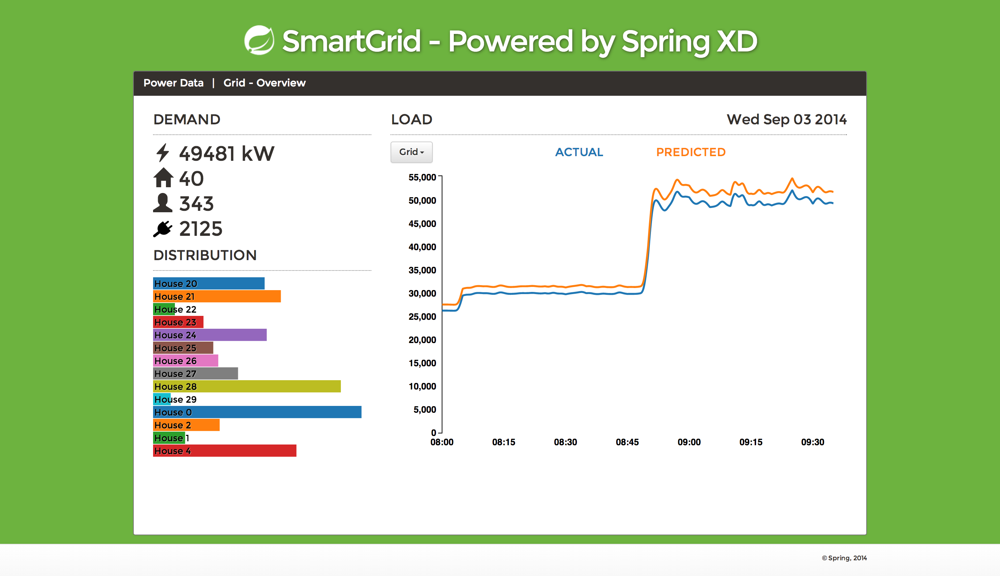

Introduction
------------

The Smartgrid-Frontend is a Spring Boot app that hosts a D3.js visualization of smartplug load distribution 
as well as the actual and predicted energy consumption by house. 
It accesses data from aggregate-counters via the REST interface provided by Spring XD.

